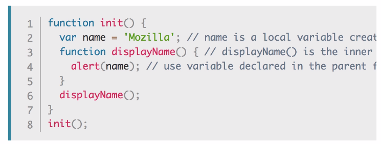
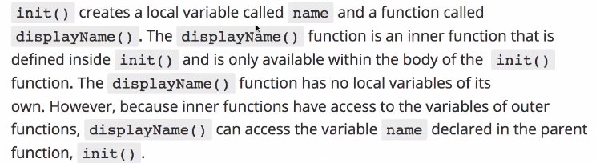

# auction-InquirerSQL
Application that uses MySQL to store item and bidding information.  

# Good to knows

# Built With
* [MySql]()
* [Inquirer]()

* [connection.query & promises](https://codeburst.io/node-js-mysql-and-promises-4c3be599909b)

#Installation
To install:

npm install --save 
